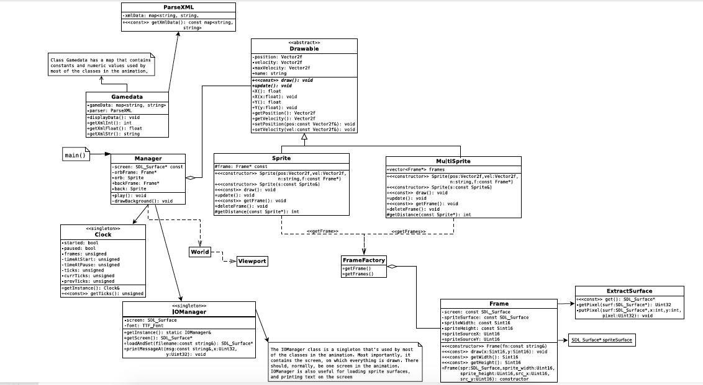
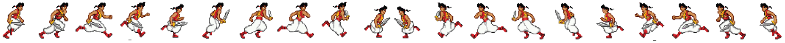
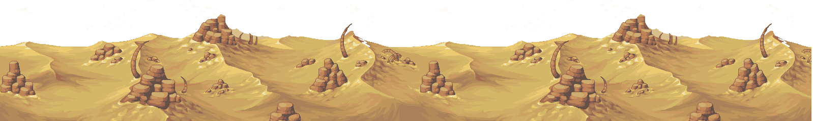

# Project Title
2D GAME DESIGN

Aladdin in the desert. The story of the Aladdin is fighting enemies (guards with AI). It uses sword to kill the enemies. Sound, HUD for Object pool, god mode and AI were the major additions from the last project.

## Description
Gameplay -
W     : Move up
S     : Move Down
A     : Move Left
D     : Move Right
Space : Shoot
R     : Reset
G     : God mode
N     : Reset Health Bar
M     : Toggle Music
F1    : HUD as how to play the game
F2    : Object pool HUD

Incorporated Features:
We added Sound and Music for the background, shooting and explosion of enemies. 

The Goal of the game is to kill all the enemies and reach the end to find Daisie with the highest score.  The Player being Aladdin kills all the enemies using his sword.

There is separate hud for object pool. This can seen by pressing F2.

### Class Diagram of framework for animations 

### Sprites

